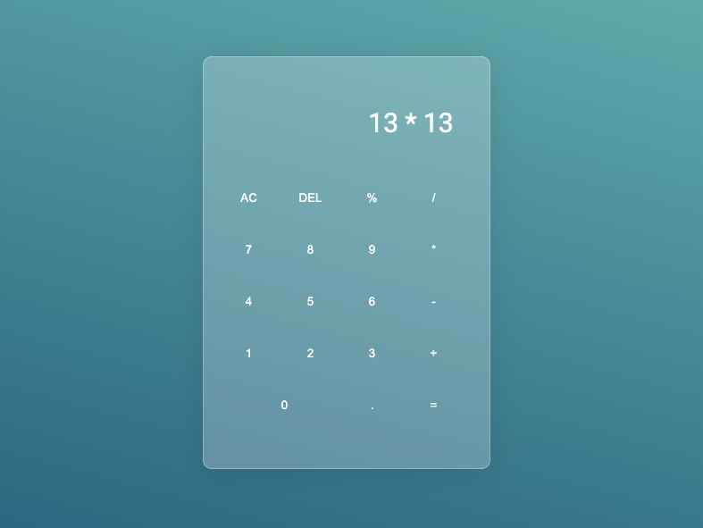

# Simple Calculator

## A fully functional calculator project built with Vanilla Javascript

[Live Demo Coming Soon](https://melissafreese.github.io/calculator/)

## Technologies Used
 * JavaScript
 * HTML5 
 * CSS3

## Features
* Perform basic arithmatic operations (addition, subtraction, multiplication, division)
* Handle decial numbers 
* Support for basic memory operations (clear, delete last digit)
* Keyboard inputs are supported for numbers, operators, backspace
and enter 

## Contributing

Contributions, issues and feature requests are welcome!

## Known issues (Work in progress)
* Division by zero returns as infinity (resolution coming soon!)

## Acknowledgement

Project inspitation from [The Odin Project](https://www.theodinproject.com/lessons/foundations-calculator)